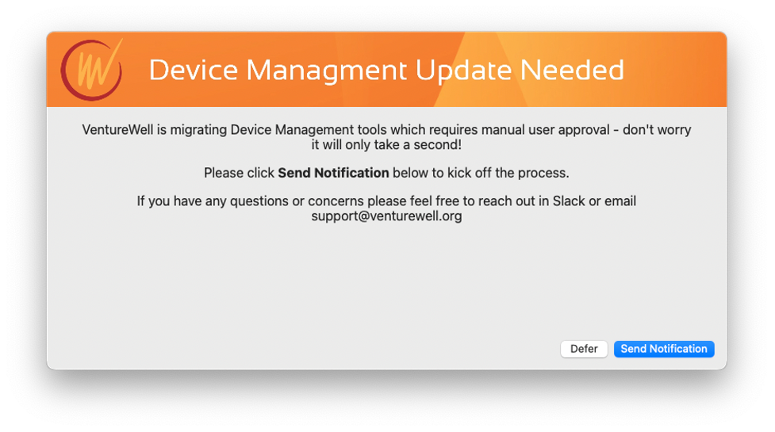
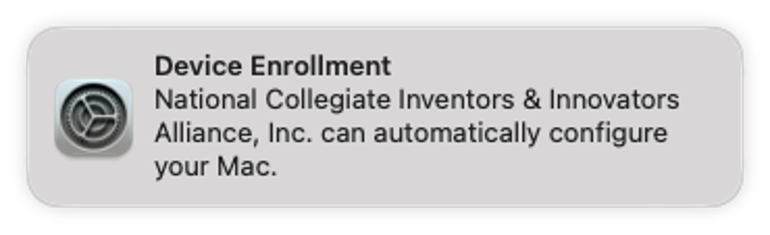
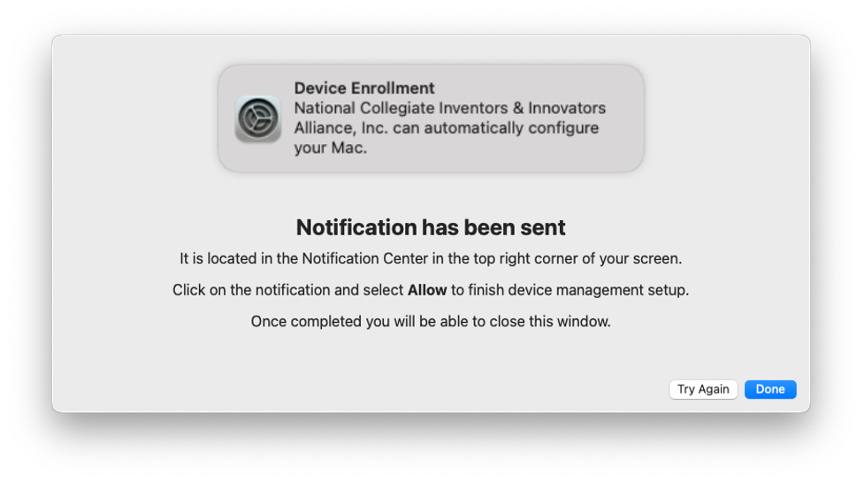
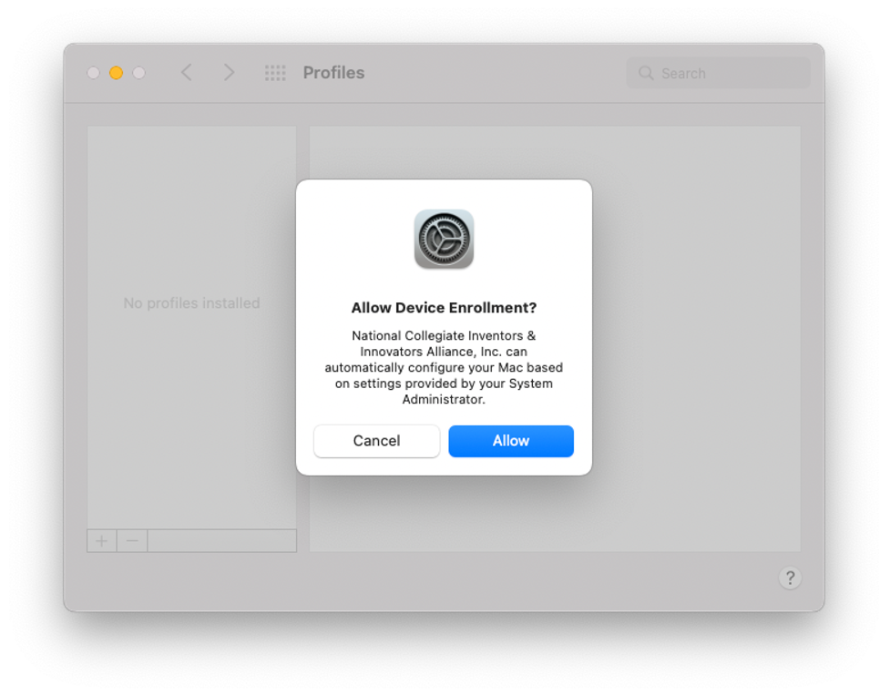

# MDM-Switch
A tool to assist in migrating MDM's. Provides a nice GUI interface (via https://github.com/bartreardon/swiftDialog) to walk users through Profiles Renew Enrollment. 

## Usage
* Remove device from MDM enrollment in previous MDM but leave binary so you can still run scripts
* Send attached script to device and the user will see the below notifications 

* Once they click "Send Notification" they will see the Profiles Renew button in the top right hand corner

* A new notification will display with additional instructions

# Once they click the notification they will be promoted to admin temporarily to be able to complete enrollment and then they will be demoted. This is the screen where they need to sign in

## Potential Issues
May not always demote users successfully. 
